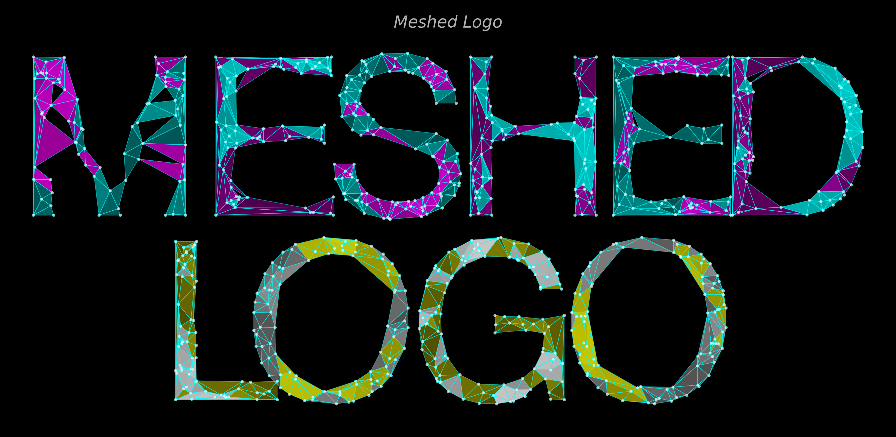
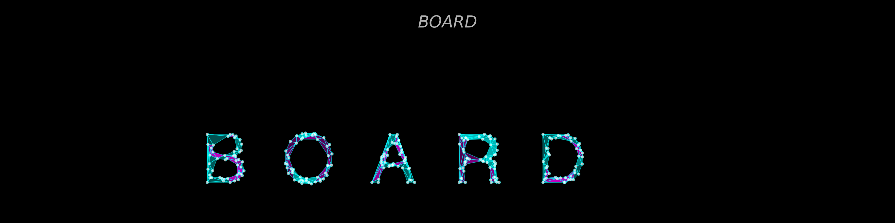

# MeshedLogo - Triangle Mesh Logo Generator
<font color="gray">(ReadME generated by AI)</font>

<p align="center">
  
</p>

A professional Python system for generating beautiful triangle-meshed logos from text and mathematical formulas.

**"MEMA & INMA forever"** - Originally created as a tribute in Euler's form: $\frac{ME}{IN} e^{i\theta}$

[](https://johnaoga.github.io/MeshedLogo/)
[](https://www.python.org/downloads/)
[](LICENSE)

## ✨ Features

- 🎨 **Triangle-based mesh rendering** with Delaunay triangulation
- 🌈 **Gradient color support** for stunning visual effects
- 🔍 **Automatic hole detection** for characters like O, A, B
- 📝 **LaTeX formula support** - render mathematical expressions like $e^{i\theta}$, $\frac{a}{b}$
- ⚙️ **Extensive rendering options**: surface, wireframe, vertices, invert mode
- 📐 **High quality output** with 300+ DPI support
- 🧩 **Modular architecture** with reusable components
- 🧪 **Full test coverage** with comprehensive unit tests

## 🚀 Quick Start

### Installation

**Option 1: Install from PyPI (Recommended)**

```bash
pip install meshedlogo
```

**Option 2: Install from source**

```bash
# Clone the repository
git clone https://github.com/johnaoga/MeshedLogo.git
cd MeshedLogo

# Install in development mode
pip install -e .

# Or install with optional dependencies
pip install -e ".[docs,dev]"
```

### Basic Usage

```python
from meshed_logo import MeshedLogo

# Create a simple logo
logo = MeshedLogo()
logo.generate("HELLO", output_file="hello.png")

# Custom colors and styling
logo.generate(
    "CODE",
    output_file="code.png",
    colors=['cyan', 'magenta', 'yellow'],
    scale=2.5,
    mesh_density=2.0
)

# LaTeX formulas - wrap in $...$
logo.generate("$e^{i\\theta}$", output_file="euler.png")
logo.generate("$\\frac{a}{b}$", output_file="fraction.png")
```

### Command Line

```bash
# After pip install, use the meshedlogo command
meshedlogo "YOUR TEXT" output/logo.png

# Or if running from source
python bin/generate_logo.py "YOUR TEXT" output/logo.png

# Run examples (source only)
python bin/example_simple.py
python bin/example_advanced.py

# Run tests (source only)
python tests/run_tests.py
```

## 📖 Documentation

**[📚 Full Documentation](https://johnaoga.github.io/MeshedLogo/)**

- [Quick Start Guide](https://johnaoga.github.io/MeshedLogo/quickstart.html) - Get started in minutes
- [User Guide](https://johnaoga.github.io/MeshedLogo/user_guide.html) - Detailed usage and customization
- [Technical Details](https://johnaoga.github.io/MeshedLogo/technical.html) - Architecture and algorithms
- [Examples Showcase](https://johnaoga.github.io/MeshedLogo/examples.html) - Visual examples and code
- [API Reference](https://johnaoga.github.io/MeshedLogo/api_reference.html) - Complete API documentation

## 🎨 Examples

<p align="center">
  
  <br>
  <em>Multi-character logo with gradient colors and mesh wireframe</em>
</p>

See the [Examples page](https://johnaoga.github.io/MeshedLogo/examples.html) in the documentation for more examples and showcase.

## 🏗️ Project Structure

```
MeshedLogo/
├── meshed_logo.py       # Main API class
├── lib/                 # Core library modules
├── bin/                 # CLI and example scripts
├── tests/               # Unit tests
├── docs/                # Sphinx documentation
└── requirements.txt     # Dependencies
```

## 🧪 Testing

All components are fully tested:

```bash
python tests/run_tests.py
```

Test coverage includes character rendering, contour extraction, mesh generation, and complete logo creation.

## 📦 Dependencies

- matplotlib >= 3.8.0
- numpy >= 1.26.0
- scipy >= 1.11.0
- Pillow >= 10.0.0
- opencv-python >= 4.8.0

## 🤝 Contributing

Contributions are welcome! The modular architecture makes it easy to extend:

- Add new rendering styles
- Implement alternative mesh algorithms
- Create new logo templates
- Improve documentation

## 📝 License

Created for MEMA & INMA. Feel free to use and modify for your own projects.

## 🙏 Acknowledgments

- Delaunay triangulation via `scipy.spatial`
- Contour extraction powered by OpenCV
- Visualization with Matplotlib

---

**For detailed documentation, visit [https://johnaoga.github.io/MeshedLogo/](https://johnaoga.github.io/MeshedLogo/)**
