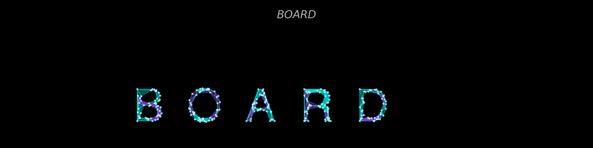
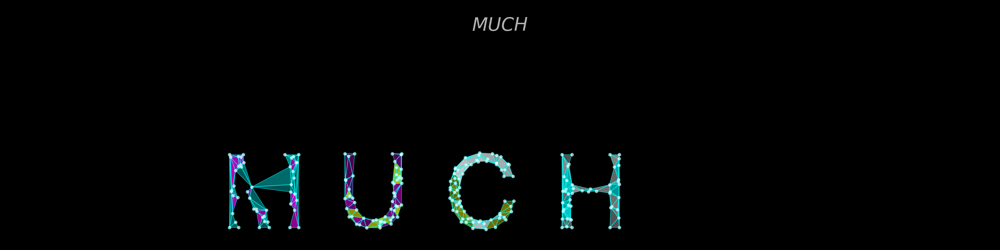

Examples Showcase
=================

This page showcases various rendering options and examples created with MeshedLogo.

Gallery
-------

**BOARD** - Multi-character logo with gradient colors from cyan to magenta, showing the mesh structure and vertices.

**MUCH** - Another multi-character example demonstrating mesh generation for various letter shapes including characters with holes.

Rendering Styles
----------------

Surface Only
~~~~~~~~~~~~

Display only the filled triangles without wireframe or vertices:

.. code-block:: python

   logo = MeshedLogo()
   logo.generate(
       "TEXT",
       output_file="surface_only.png",
       show_wireframe=False,
       show_vertices=False,
       colors=['cyan', 'magenta']
   )

Wireframe Only
~~~~~~~~~~~~~~

Display only the mesh lines without surface or vertices:

.. code-block:: python

   logo = MeshedLogo()
   logo.generate(
       "MESH",
       output_file="wireframe_only.png",
       show_surface=False,
       show_vertices=False,
       wireframe_thickness=1.0,
       colors=['cyan']
   )

Vertices Only
~~~~~~~~~~~~~

Display only the vertex points:

.. code-block:: python

   logo = MeshedLogo()
   logo.generate(
       "DOTS",
       output_file="vertices_only.png",
       show_surface=False,
       show_wireframe=False,
       vertex_size=15.0,
       colors=['cyan']
   )

Combined Styles
~~~~~~~~~~~~~~~

Surface with thick wireframe:

.. code-block:: python

   logo = MeshedLogo()
   logo.generate(
       "TEXT",
       output_file="combined.png",
       show_surface=True,
       show_wireframe=True,
       wireframe_thickness=2.0,
       colors=['cyan', 'magenta', 'yellow']
   )

Invert Mode
~~~~~~~~~~~

Mesh the background instead of the character:

.. code-block:: python

   logo = MeshedLogo()
   logo.generate(
       "TEXT",
       output_file="inverted.png",
       invert_mode=True,
       invert_margin=50,
       colors=['cyan', 'magenta']
   )

In invert mode, the character becomes a hole in the meshed background, creating a negative space effect.

Random Vertices
~~~~~~~~~~~~~~~

Display 50% of vertices randomly selected:

.. code-block:: python

   logo = MeshedLogo()
   logo.generate(
       "TEXT",
       output_file="random_vertices.png",
       vertex_mode='random',
       vertex_size=12.0,
       colors=['cyan', 'magenta']
   )

Multi-Component Examples
------------------------

Side by Side
~~~~~~~~~~~~

.. code-block:: python

   logo = MeshedLogo(canvas_size=(1400, 700))

   components = [
       {
           'text': 'MESHED',
           'position': (100, 400),
           'scale': 2.5,
           'colors': ['cyan', 'magenta']
       },
       {
           'text': 'LOGO',
           'position': (800, 400),
           'scale': 2.5,
           'colors': ['yellow', 'white']
       }
   ]

   logo.generate_multi(components, output_file="side_by_side.png")

Stacked
~~~~~~~

.. code-block:: python

   logo = MeshedLogo(canvas_size=(1000, 1000))

   components = [
       {
           'text': 'TOP',
           'position': (300, 700),
           'scale': 2.0,
           'colors': ['cyan', 'magenta']
       },
       {
           'text': 'BOTTOM',
           'position': (200, 300),
           'scale': 2.0,
           'colors': ['yellow', 'white']
       }
   ]

   logo.generate_multi(components, output_file="stacked.png")

Color Schemes
-------------

Monochrome
~~~~~~~~~~

.. code-block:: python

   logo.generate("TEXT", colors=['white'])

Dual Color
~~~~~~~~~~

.. code-block:: python

   logo.generate("TEXT", colors=['cyan', 'magenta'])

Multi Color
~~~~~~~~~~~

.. code-block:: python

   logo.generate("TEXT", colors=['cyan', 'magenta', 'yellow', 'white'])

The gradient is applied from left to right across the character bounds.

Mesh Density Variations
-----------------------

Low Density (Coarse Mesh)
~~~~~~~~~~~~~~~~~~~~~~~~~~

.. code-block:: python

   logo.generate("TEXT", mesh_density=0.5)

Creates ~25 interior points for a sparser, more geometric look.

Default Density
~~~~~~~~~~~~~~~

.. code-block:: python

   logo.generate("TEXT", mesh_density=1.5)

Creates ~75 interior points - balanced between detail and simplicity.

High Density (Fine Mesh)
~~~~~~~~~~~~~~~~~~~~~~~~~

.. code-block:: python

   logo.generate("TEXT", mesh_density=3.0)

Creates ~150 interior points for a more detailed mesh.

Scale Examples
--------------

Small Scale
~~~~~~~~~~~

.. code-block:: python

   logo.generate("TEXT", scale=1.0)

Character height ~100 pixels.

Medium Scale (Default)
~~~~~~~~~~~~~~~~~~~~~~

.. code-block:: python

   logo.generate("TEXT", scale=2.0)

Character height ~200 pixels.

Large Scale
~~~~~~~~~~~

.. code-block:: python

   logo.generate("TEXT", scale=4.0)

Character height ~400 pixels.

Complete Examples
-----------------

Example 1: Neon Effect
~~~~~~~~~~~~~~~~~~~~~~

.. code-block:: python

   logo = MeshedLogo(background_color='black')
   logo.generate(
       "NEON",
       output_file="neon.png",
       colors=['#00ffff', '#ff00ff', '#ffff00'],
       show_surface=False,
       wireframe_thickness=1.5,
       vertex_mode='random',
       vertex_size=10.0,
       mesh_density=2.0,
       scale=3.0,
       dpi=300
   )

Creates a neon wireframe effect with random glowing vertices.

Example 2: Minimalist
~~~~~~~~~~~~~~~~~~~~~

.. code-block:: python

   logo = MeshedLogo(background_color='white')
   logo.generate(
       "MINIMAL",
       output_file="minimal.png",
       colors=['#000000'],
       show_vertices=False,
       wireframe_thickness=0.3,
       mesh_density=1.0,
       scale=2.5,
       dpi=300
   )

Creates a minimalist look with thin black lines on white.

Example 3: Abstract Art
~~~~~~~~~~~~~~~~~~~~~~~

.. code-block:: python

   logo = MeshedLogo(canvas_size=(1200, 1200), background_color='black')
   logo.generate(
       "ART",
       output_file="abstract.png",
       colors=['#ff0000', '#00ff00', '#0000ff'],
       show_wireframe=True,
       show_vertices=True,
       wireframe_thickness=1.0,
       vertex_size=12.0,
       vertex_mode='all',
       mesh_density=2.5,
       scale=4.0,
       dpi=600
   )

High-density mesh with RGB gradient for an abstract art piece.

Example 4: Corporate Logo
~~~~~~~~~~~~~~~~~~~~~~~~~~

.. code-block:: python

   logo = MeshedLogo(canvas_size=(1400, 600), background_color='#1a1a1a')

   components = [
       {
           'text': 'MESH',
           'position': (100, 400),
           'scale': 2.5,
           'colors': ['#0088ff', '#00ffff']
       },
       {
           'text': 'TECH',
           'position': (750, 400),
           'scale': 2.5,
           'colors': ['#00ffff', '#00ff88']
       }
   ]

   logo.generate_multi(
       components,
       name="MeshTech",
       output_file="corporate.png",
       show_vertices=False,
       dpi=300
   )

Professional corporate logo with brand colors.

Example 5: MEMA & INMA Classic
~~~~~~~~~~~~~~~~~~~~~~~~~~~~~~

.. code-block:: python

   logo = MeshedLogo()
   logo.generate_mema_inma(output_file="mema_inma.png")

The original tribute logo with the mathematical formula rendering.

Command Line Examples
---------------------

Simple Generation
~~~~~~~~~~~~~~~~~

.. code-block:: bash

   python bin/generate_logo.py "HELLO" output/hello.png

Using Example Scripts
~~~~~~~~~~~~~~~~~~~~~

.. code-block:: bash

   # Run simple examples (recommended for beginners)
   python bin/example_simple.py

   # Run advanced examples (shows all features)
   python bin/example_advanced.py

The example scripts create various logos demonstrating different features and save them to the output directory.

Tips for Great Logos
--------------------

1. **Choose appropriate mesh density**: Complex characters benefit from higher density
2. **Experiment with colors**: Gradient colors create dynamic effects
3. **Consider the background**: Dark backgrounds work well with bright colors
4. **Use high DPI for printing**: 300+ DPI recommended
5. **Test different rendering modes**: Surface, wireframe, and vertex combinations
6. **Adjust scale for canvas**: Ensure text fits comfortably on canvas
7. **Use invert mode creatively**: Great for special effects and negative space

Further Exploration
-------------------

- Check ``bin/example_simple.py`` for basic usage patterns
- Check ``bin/example_advanced.py`` for advanced techniques
- See :doc:`user_guide` for detailed API documentation
- See :doc:`technical` to understand the mesh generation process
