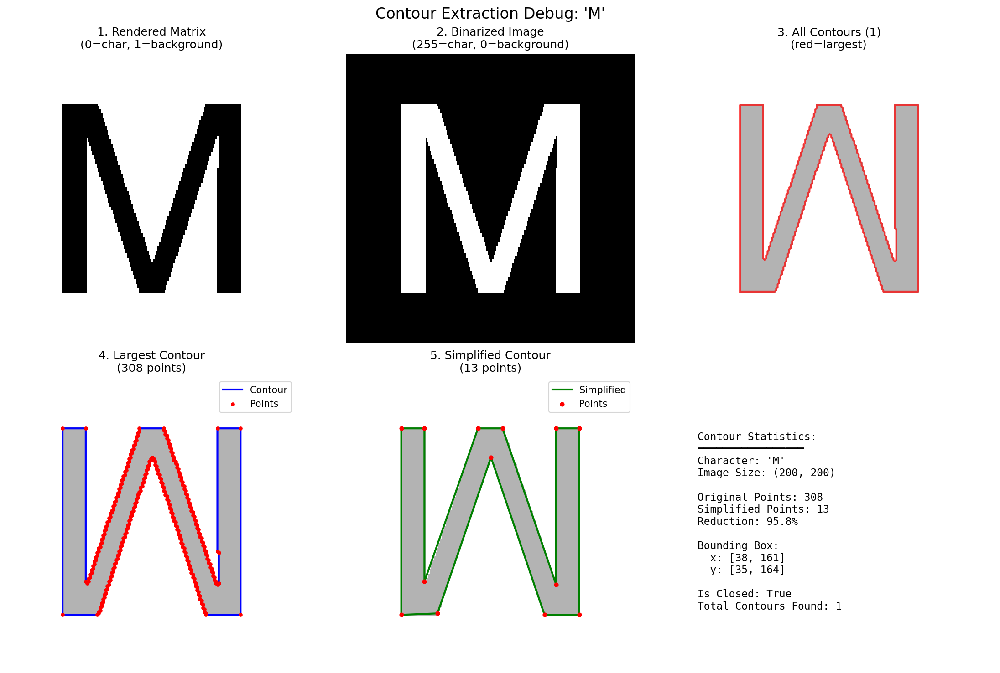
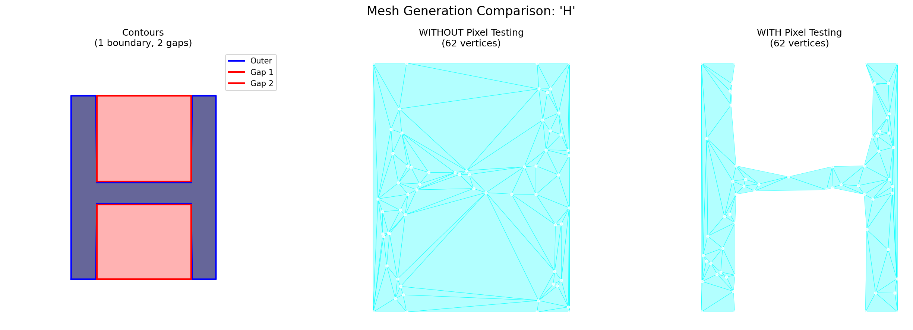
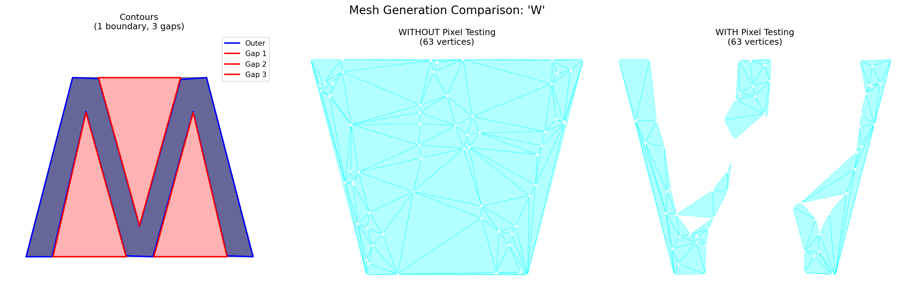

Technical Documentation
=======================

This section explains the internal architecture and the mesh generation process.

Architecture Overview
---------------------

MeshedLogo uses a modular pipeline architecture with 5 independent components:

1. **CharacterRenderer** - Renders characters to binary images
2. **StringProcessor** - Processes strings and formulas
3. **ContourExtractor** - Extracts outline points from images
4. **MeshGenerator** - Creates triangle meshes from points
5. **LogoGenerator** - Orchestrates all components

The Pipeline
------------

The logo generation process follows these steps:

Step 1: Character Rendering
~~~~~~~~~~~~~~~~~~~~~~~~~~~~

A character is rendered as a binary matrix where:

- ``0`` = character pixels (foreground)
- ``1`` = background pixels

The image above shows the complete rendering pipeline for the letter 'M':

1. **Rendered Matrix** - The character rendered as a binary image
2. **Binarized Image** - Converted to 255/0 format for OpenCV (255=char, 0=background)
3. **All Contours** - All detected contours (red=largest/outer contour)
4. **Largest Contour** - The main outline with 308 points
5. **Simplified Contour** - Reduced to 13 points (95.8% reduction) using Douglas-Peucker algorithm

**Implementation:**

.. code-block:: python

   from lib.character_renderer import CharacterRenderer

   renderer = CharacterRenderer(default_width=200, default_height=200)
   char_img = renderer.render('M')
   # Returns CharacterImage with binary matrix

Step 2: Contour Extraction
~~~~~~~~~~~~~~~~~~~~~~~~~~~

The contour extraction process:

1. Converts the binary matrix (0-1) to grayscale (255-0)
2. Uses OpenCV's ``findContours()`` to detect edges
3. Selects the largest contour (outer boundary)
4. Simplifies using Douglas-Peucker algorithm
5. Detects and handles holes (interior contours)

**Hole Detection:**

Characters like 'O', 'A', 'B', 'P', 'R' have interior holes. The system automatically detects and incorporates these.

The letter 'H' shows hole detection in action. The left panel shows the contours: the outer boundary (blue) and two interior gaps (red/pink). Without pixel testing, the mesh fills the holes incorrectly. With pixel testing enabled, the mesh correctly preserves the character structure.

The letter 'W' demonstrates proper handling of multiple interior holes. The left panel shows 1 outer boundary (blue) and 3 interior gaps (red). Pixel testing ensures triangles only appear where the character exists.

**Implementation:**

.. code-block:: python

   from lib.contour_extractor import ContourExtractor

   extractor = ContourExtractor(method='opencv')
   contour = extractor.extract_largest(char_img.matrix, simplify=True)
   # Returns ContourData with (x,y) points

   # With hole detection
   contour_data = extractor.extract_with_holes(char_img.matrix)
   # Returns outer contour + list of hole contours

Step 3: Mesh Generation
~~~~~~~~~~~~~~~~~~~~~~~~

The mesh generation uses Delaunay triangulation with several enhancements:

1. **Boundary Points**: Contour points form the boundary
2. **Interior Points**: Random points added inside for better triangulation
3. **Hole Handling**: Interior holes are incorporated as constraints
4. **Triangle Filtering**: Only triangles inside the character are kept

**Delaunay Triangulation:**

Uses ``scipy.spatial.Delaunay`` to create a triangle mesh from points:

- Ensures no triangle has vertices outside its circumcircle
- Maximizes the minimum angle of all triangles
- Creates aesthetically pleasing meshes

**Interior Point Generation:**

.. code-block:: python

   num_interior_points = int(mesh_density * 50)  # Default mesh_density=1.5
   # Generates 75 interior points for density=1.5

**Triangle Filtering (Pixel Testing):**

After triangulation, each triangle is tested:

1. Calculate triangle centroid
2. Check if centroid pixel value == 0 (character)
3. Keep triangle if inside character, discard otherwise

This ensures the mesh only covers the actual character shape, especially important for characters with holes.

**Implementation:**

.. code-block:: python

   from lib.mesh_generator import MeshGenerator

   generator = MeshGenerator()
   mesh = generator.generate(
       contour.points,
       add_interior_points=True,
       num_interior_points=75,
       filter_by_image=char_img.matrix  # Enable pixel testing
   )
   # Returns MeshData with vertices and triangles

Step 4: Logo Composition
~~~~~~~~~~~~~~~~~~~~~~~~~

The final step renders the mesh to a high-quality image:

1. Creates matplotlib figure with specified canvas size
2. Renders each triangle with gradient colors
3. Optionally draws wireframe edges
4. Optionally draws vertex points
5. Saves to PNG at specified DPI

**Gradient Coloring:**

Triangles are colored based on their position:

- First color applied to leftmost triangles
- Last color applied to rightmost triangles
- Linear interpolation for triangles in between

**Implementation:**

.. code-block:: python

   from lib.logo_generator import LogoGenerator

   logo_gen = LogoGenerator(canvas_size=(1200, 800))
   logo = logo_gen.render_logo(
       mesh_data,
       colors=['cyan', 'magenta'],
       show_wireframe=True,
       show_vertices=True
   )

Data Structures
---------------

CharacterImage
~~~~~~~~~~~~~~

Dataclass representing a rendered character:

.. code-block:: python

   @dataclass
   class CharacterImage:
       matrix: np.ndarray      # Binary matrix (0=char, 1=background)
       character: str          # The rendered character
       width: int              # Image width
       height: int             # Image height
       filepath: str = None    # Saved file path (optional)

       def save(self, filepath: str) -> str:
           """Save image to file"""

ContourData
~~~~~~~~~~~

Dataclass representing extracted contour points:

.. code-block:: python

   @dataclass
   class ContourData:
       points: np.ndarray      # (N, 2) array of (x,y) coordinates
       num_points: int         # Number of points

       def get_bounding_box(self) -> Tuple[float, float, float, float]:
           """Returns (x_min, y_min, x_max, y_max)"""

       def simplify(self, epsilon: float = 2.0) -> 'ContourData':
           """Simplify using Douglas-Peucker algorithm"""

       def save_points(self, filepath: str, format: str = 'auto'):
           """Save points to file (.txt, .csv, .npy)"""

MeshData
~~~~~~~~

Dataclass representing a triangle mesh:

.. code-block:: python

   @dataclass
   class MeshData:
       points: np.ndarray      # (N, 2) array of vertex coordinates
       triangles: np.ndarray   # (M, 3) array of triangle indices
       num_vertices: int       # Number of vertices
       num_triangles: int      # Number of triangles

       def get_edges(self) -> np.ndarray:
           """Returns unique edges as (E, 2) array"""

       def get_triangle_areas(self) -> np.ndarray:
           """Returns array of triangle areas"""

       def save_mesh(self, filepath: str, format: str = 'auto'):
           """Save mesh to file (.obj, .ply, .txt)"""

Algorithms
----------

Douglas-Peucker Simplification
~~~~~~~~~~~~~~~~~~~~~~~~~~~~~~~

Reduces the number of contour points while preserving shape:

1. Connects first and last points with a line
2. Finds the point with maximum perpendicular distance
3. If distance > epsilon, keep the point and recurse on both sides
4. Otherwise, discard all intermediate points

**Effect**: Reduces 308 points to 13 points (95.8% reduction) for 'M'

**Parameter**: ``epsilon`` controls tolerance (higher = more simplification)

Delaunay Triangulation
~~~~~~~~~~~~~~~~~~~~~~~

Creates optimal triangle mesh from point set:

**Properties:**

- No triangle contains another point inside its circumcircle
- Maximizes minimum angles (avoids sliver triangles)
- Unique solution for non-degenerate point sets

**Time Complexity**: O(n log n) where n = number of points

Centroid-Based Filtering
~~~~~~~~~~~~~~~~~~~~~~~~~

Determines if a triangle belongs to the character:

1. Calculate centroid: ``(x1+x2+x3)/3, (y1+y2+y3)/3``
2. Convert to integer pixel coordinates
3. Check pixel value at centroid position
4. Keep if ``matrix[y, x] == 0`` (character pixel)

This is crucial for characters with holes, ensuring interior regions remain empty.

Performance
-----------

**Typical Performance (on M1 Mac):**

- Character rendering: ~10ms
- Contour extraction: ~5ms
- Mesh generation: ~20ms (75 interior points)
- Logo rendering: ~100ms (300 DPI)
- **Total**: ~135ms per character

**Scaling:**

- Time increases linearly with mesh_density
- DPI affects rendering time quadratically
- Multiple components are processed independently

Memory Usage
------------

**Typical Memory (per character):**

- Character matrix: ~160KB (200×200 pixels)
- Contour points: ~1KB (13 simplified points)
- Mesh vertices: ~2KB (~100 points)
- Mesh triangles: ~3KB (~100 triangles)
- **Total**: ~166KB per character

**Output File Size:**

- 300 DPI PNG: ~100-500KB (depends on complexity)
- 600 DPI PNG: ~500-2MB

Module Details
--------------

CharacterRenderer (character_renderer.py)
~~~~~~~~~~~~~~~~~~~~~~~~~~~~~~~~~~~~~~~~~~

**Purpose**: Render characters to binary image matrices

**Key Methods:**

- ``render(char, width, height, thickness)`` - Render single character
- ``_get_font()`` - Get system font (Arial or Helvetica)

**Output**: CharacterImage with 0=character, 1=background

StringProcessor (string_processor.py)
~~~~~~~~~~~~~~~~~~~~~~~~~~~~~~~~~~~~~~

**Purpose**: Process text strings and mathematical formulas

**Key Methods:**

- ``process(text, save_dir)`` - Process entire string
- ``_is_formula(text)`` - Detect formula syntax

**Formula Support**: Recognizes patterns like ``ME/IN e^{iθ}``

ContourExtractor (contour_extractor.py)
~~~~~~~~~~~~~~~~~~~~~~~~~~~~~~~~~~~~~~~~

**Purpose**: Extract outline points from images

**Key Methods:**

- ``extract_largest(image, simplify)`` - Extract main contour
- ``extract_with_holes(image, simplify)`` - Extract with holes
- ``_find_contours(image)`` - OpenCV contour detection
- ``_simplify_contour(points, epsilon)`` - Douglas-Peucker simplification

**Critical Fix**: Inverts binary matrices (0-1 to 255-0) for OpenCV compatibility

MeshGenerator (mesh_generator.py)
~~~~~~~~~~~~~~~~~~~~~~~~~~~~~~~~~~

**Purpose**: Create triangle meshes from point sets

**Key Methods:**

- ``generate(points, add_interior_points, filter_by_image)`` - Generate mesh
- ``_add_interior_points(points, num)`` - Add random interior points
- ``_filter_triangles(triangles, points, image)`` - Pixel-based filtering

**Key Feature**: Pixel testing for accurate hole handling

LogoGenerator (logo_generator.py)
~~~~~~~~~~~~~~~~~~~~~~~~~~~~~~~~~~

**Purpose**: Orchestrate all components and render final logo

**Key Methods:**

- ``render_logo(mesh_data, colors, show_wireframe, show_vertices)`` - Render single component
- ``create_multi_logo(components)`` - Multi-component logos
- ``create_mema_inma_logo()`` - Classic MEMA & INMA

**Color System**: Gradient interpolation based on x-coordinate

Extension Points
----------------

The modular architecture allows easy extension:

**New Character Sources:**

Extend ``CharacterRenderer`` with custom rendering methods (SVG, fonts, images)

**New Contour Algorithms:**

Add methods to ``ContourExtractor`` for alternative edge detection

**New Mesh Algorithms:**

Extend ``MeshGenerator`` with different triangulation methods (constrained Delaunay, advancing front)

**New Logo Templates:**

Add factory methods to ``LogoGenerator`` for pre-configured styles

See ``bin/example_advanced.py`` for examples of using individual modules.
